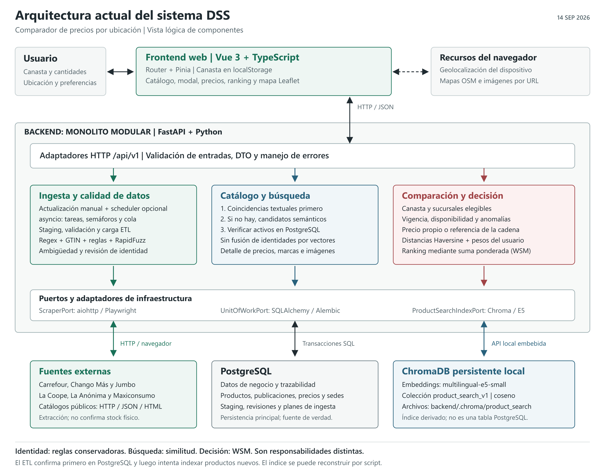

# Arquitectura actual del sistema DSS

Fecha de corte: 2026-09-14. Vista del codigo existente, no una propuesta de
microservicios ni una certificacion de despliegue productivo. La tesis
recibida se conserva sin modificaciones en `docs/tesis-anterior/Tesis_UNPSJB/`.



## 1. Estilo arquitectonico

El sistema utiliza una arquitectura cliente-servidor. El cliente es una SPA
en Vue 3 y TypeScript; el servidor es un monolito modular en Python/FastAPI.
El backend organiza sus responsabilidades con capas de dominio, aplicacion,
infraestructura e interfaces, siguiendo patrones de arquitectura limpia y
puertos/adaptadores. Esta clasificacion describe la organizacion predominante:
no implica que todas las dependencias satisfagan una separacion estricta.
Por ejemplo, el caso de uso ETL importa actualmente normalizadores y matcher
desde infraestructura de ingestion.

No son microservicios: catalogo, precios, ingesta, geolocalizacion y decision
se ejecutan como partes de la misma aplicacion. El scheduler es una tarea
opcional del ciclo de vida de FastAPI, no un servicio Celery. La cola de
extraccion es `asyncio.Queue` en memoria, no un broker distribuido.

PostgreSQL es la persistencia principal en el escenario local informado por
el usuario. SQLite sigue soportado para demostracion/pruebas y es el valor
predeterminado del codigo si no se configura otra conexion. Chroma utiliza
un cliente persistente embebido y archivos locales; no requiere un servidor
Chroma remoto. El diagrama representa componentes logicos, no un mapa de
procesos o servidores efectivamente inspeccionados en ejecucion.

## 2. Frontend y navegador

Tecnologias: Vue 3, TypeScript, Vite, Vue Router, Pinia, Tailwind, Leaflet y
Lucide. Rutas actuales: `/`, `/comparar` y `/datos`.

- Las vistas coordinan busqueda, canasta, actualizacion, comparacion y ranking.
- `services/api.ts` adapta contratos JSON del backend al modelo del frontend.
  Puede trabajar en modo live o mock; mock no consulta las fuentes reales.
- Pinia gestiona la canasta y preferencias, con persistencia en localStorage.
- ProductImage y ProductDetailsModal muestran imagenes por URL, atributos y
  precios. No existe un almacen propio de archivos de imagen del producto.
- La ubicacion proviene de la interaccion/geolocalizacion del navegador.
  Leaflet solicita teselas OpenStreetMap; Haversine se calcula en el backend.
- La busqueda de catalogo y el boton de actualizar precios son acciones
  distintas: buscar no implica ejecutar todos los scrapers.

## 3. Backend: responsabilidades

| Modulo | Responsabilidad actual |
|---|---|
| catalog | Productos canonicos, marcas, categorias, publicaciones de origen y busqueda. |
| supermarkets | Cadenas, sucursales y ubicaciones administrativas. |
| prices | Consulta de precios, comparaciones, historial y politicas de validez. |
| basket | Validacion de la canasta enviada para comparar. No equivale a una cuenta de usuario persistida. |
| geo | Coordenadas y calculo de distancias geograficas. |
| decision | Construccion de alternativas elegibles y ranking WSM. |
| ingestion | Fuentes, corridas, staging, ETL, identidad, revisiones y programacion de actualizaciones. |
| shared | Configuracion, errores, infraestructura SQL y unidad de trabajo compartida. |

Los adaptadores HTTP exponen recursos bajo `/api/v1`. Las entradas se validan
antes de ejecutar casos de uso; los DTO separan la respuesta publica de las
entidades y los modelos de persistencia. `/health` esta fuera del prefijo.

Ejemplos de contratos principales:

| Accion | Metodo y recurso |
|---|---|
| Listar/buscar productos | `GET /api/v1/catalog/products` |
| Consultar sucursales | `GET /api/v1/branches` |
| Consultar precios vigentes | `GET /api/v1/prices/current` |
| Validar canasta | `POST /api/v1/basket/validate` |
| Generar ranking | `POST /api/v1/decisions/ranking` |
| Actualizar fuentes concurrentemente | `POST /api/v1/ingestion/sources/refresh-concurrently` |

## 4. Puertos, adaptadores y transacciones

`UnitOfWorkPort` permite a los casos de uso trabajar con repositorios y
transacciones sin construir conexiones concretas. `SQLAlchemyUnitOfWork`
implementa ese contrato, comparte una sesion asincrona entre repositorios y
expone commit/rollback. SQLAlchemy persiste en la base configurada; Alembic
versiona el esquema.

`ScraperPort` abstrae los extractores. La fabrica selecciona el adaptador de
cada fuente. `ProductSearchIndexPort` define `search`, `upsert_products` y
`rebuild`, implementados por `ChromaProductSearchIndex`.

La composicion se realiza desde dependencias de FastAPI y constructores de
casos de uso. Chroma se inicializa de forma diferida y usa Sentence
Transformers localmente. Sus llamadas concretas son sincronas aunque el
puerto tenga metodos async; no hay un worker dedicado de embeddings.

## 5. Flujo de ingesta y homogeneizacion

```text
Solicitud manual / plan del scheduler / script
    -> fabrica de scrapers -> fuentes publicas
    -> extraccion concurrente -> resultados en cola
    -> corrida auditada y staging relacional
    -> validaciones y limpieza
    -> normalizacion e identidad
    -> productos / publicaciones / precios / estados de staging
    -> commit en PostgreSQL
    -> intento de upsert vectorial de productos nuevos
```

Las seis fuentes actuales son Carrefour, Chango Mas, Jumbo, La Coope,
La Anonima y Maxiconsumo. Cinco adaptadores utilizan aiohttp para datos
HTTP/JSON/HTML; La Anonima usa Playwright. Los extractores difieren por
estructura de catalogo y contexto regional. No son integraciones internas
con inventarios fisicos de supermercados.

El refresco concurrente usa TaskGroup y Semaphore para limitar I/O, y una
Queue para entregar resultados a carga serializada dentro de esa ejecucion.
Esto no significa que toda escritura del sistema este globalmente serializada:
otros requests o planes pueden ejecutarse a la vez. El scheduler persiste
planes y ejecuciones, consulta vencimientos y reclama trabajos con lease.

La homogeneizacion combina:

- Expresiones regulares y normalizacion textual para cantidades, unidades,
  packs y representaciones equivalentes.
- Publicacion ya conocida y GTIN valido como evidencias de identidad.
- Restricciones estructurales de presentacion, marca y variantes.
- RapidFuzz como similitud lexica subordinada a restricciones, no como una
  prueba suficiente de identidad.
- Decisiones `matched`, `no_match` y `review_required`. En el ETL, los casos
  ambiguos pueden quedar en staging como `unmatched` con motivo/candidatos;
  no toda ambiguedad crea automaticamente una fila de revision canonica.
- Herramientas de revision/consolidacion auditada y enriquecimiento por
  evidencia. Las categorias recuperadas no constituyen una taxonomia completa.

Las URLs de imagen se validan y conservan por publicacion y producto. El ETL
no descarga archivos de imagen. Un fallo del upsert Chroma posterior al commit
registra una advertencia: no revierte la carga relacional ya confirmada.

## 6. Flujo de busqueda semantica

```text
Texto del usuario -> GET catalog/products?q=...
    -> busqueda textual en el catalogo
        -> hay coincidencias: devolver las textuales
        -> no hay: consultar Chroma si esta habilitado
            -> E5 representa la consulta
            -> recuperar IDs por similitud coseno
            -> aplicar umbral
            -> recuperar productos activos desde PostgreSQL
            -> filtrar categoria, evitar duplicados y devolver DTO
```

Una consulta vacia conserva el listado del catalogo. Para la recuperacion
semantica se utiliza `top_k = min(limite * 3, 50)` y umbral configurable,
predeterminado 0.35. No se envia el score semantico al frontend. Si el indice
no devuelve candidatos o falla, se conserva el resultado textual, que en
este camino puede ser vacio. Un umbral no garantiza relevancia.

El modelo es `intfloat/multilingual-e5-small`, mediante Sentence Transformers.
Los documentos usan el prefijo `passage:` y contienen nombre, marca,
categoria, presentacion y codigo; las consultas usan `query:`. Chroma mantiene
la coleccion `product_search_v1` con distancia coseno en
`backend/.chroma/product_search` por defecto.

PostgreSQL sigue siendo la autoridad sobre existencia/actividad del producto.
El indice es derivado y reconstruible mediante
`backend/scripts/reindex_product_search_vectors.py`. El upsert al final del
ETL cubre productos creados; no es una sincronizacion transaccional continua
de todas las modificaciones, fusiones o bajas.

**La busqueda no decide equivalencias canonicas ni aprueba merges.** No se
entrena un modelo propio, no se utiliza un LLM generativo y Chroma no cambia
el algoritmo WSM. El modelo se descarga inicialmente y se reutiliza desde cache.

## 7. Flujo de comparacion y ranking

```text
Canasta + cantidades + coordenadas + pesos
    -> validacion de productos y alternativas
    -> precios validos segun disponibilidad, vigencia y anomalias
    -> precio propio de sucursal; si falta, referencia de la misma cadena
    -> excluir alternativas que siguen sin completar la canasta
    -> costo total + distancia Haversine + ahorro frente al costo maximo
    -> normalizacion min-max -> suma ponderada -> ranking
    -> frontend: resultados, desglose y mapa
```

Las alternativas operativas son sucursales activas con coordenadas verificadas,
no solamente marcas comerciales de supermercados. Haversine expresa distancia
geografica aproximada, no recorrido vial ni tiempo de viaje.

La referencia por cadena solo completa precios ausentes para el ranking;
no genera filas ficticias por sucursal ni confirma stock fisico. Un precio
valido propio tiene prioridad. El detalle de precios consultado por el modal
no debe interpretarse como un registro de todas esas inferencias.

El WSM combina precio, distancia y ahorro con pesos configurables. En la
definicion actual, ahorro = costo maximo - costo individual; tras normalizar,
precio y ahorro son redundantes. Con pesos iniciales 0.6/0.3/0.1, el efecto
equivale a peso economico 0.7 y distancia 0.3. Esta observacion describe el
modelo existente; no se cambio como parte de esta documentacion.

## 8. Datos y despliegue local

La persistencia relacional comprende 15 tablas declaradas en los modelos:

- Catalogo: `categoria_producto`, `marca`, `producto`, `producto_fuente`.
- Ubicaciones: `provincia`, `ciudad`, `supermercado`, `sucursal`.
- Precios: `precio`.
- Ingesta: `scraping_source`, `scraping_run`, `producto_extraido`,
  `revision_identidad_producto`, `scraping_schedule`, `scheduled_refresh_execution`.

Chroma tiene almacenamiento propio; sus archivos internos no son tablas de
negocio PostgreSQL ni sustituyen las anteriores. Las imagenes se almacenan
como enlaces, no como blobs.

El repositorio incluye un `docker-compose.yml` para PostgreSQL 16, no para
desplegar toda la aplicacion. El frontend se desarrolla con Vite y FastAPI
se ejecuta con Uvicorn. La presencia de esa configuracion no demuestra que
el contenedor se encuentre activo ni acredita despliegue productivo.

## 9. Limites y riesgos actuales

- No presentar la separacion modular como servicios desplegados de manera
  independiente, ni la cola en memoria como mensajeria durable.
- No hay autenticacion ni autorizacion integrada en los routers observados;
  las operaciones de ingesta/revision requieren proteccion para publicacion.
- La indexacion local no es atomica con PostgreSQL; se necesita reconstruccion
  ante desalineacion. Carga del modelo e inferencia pueden afectar latencia.
- Las consultas semanticas y alias todavia requieren evaluacion de relevancia.
  No basta con superar pruebas de identidad para demostrar buena busqueda.
- La cobertura de marcas/categorias y de publicaciones equivalentes es parcial.
- Las fusiones pueden dejar IDs antiguos en canastas persistidas del navegador;
  la reconciliacion de esa referencia requiere tratamiento adicional.
- Precios por cadena, fuentes publicas y coordenadas no garantizan disponibilidad
  ni conveniencia real de compra. Documentar fechas, limites y supuestos.

## 10. Ubicacion en la tesis

En el capitulo 3, **Diseno del Sistema / Arquitectura General**, incorporar
el SVG de esta carpeta y explicar cliente, monolito modular y persistencias.
Ampliar **Diseno Modular** con la tabla de responsabilidades. Usar las
secciones 5-7 de este documento en **Implementacion del Pipeline ETL**, una
nueva **Implementacion de la Busqueda de Productos** y **Implementacion del
Modelo Multicriterio**, respectivamente.

Texto de base para adaptar al estilo de la tesis:

> El sistema adopta una arquitectura cliente-servidor con un frontend web
> desarrollado en Vue y un backend organizado como monolito modular en
> FastAPI. La logica se distribuye en modulos especializados de catalogo,
> ingesta, precios, ubicaciones, canasta, geolocalizacion y decision. El acceso
> a infraestructura se organiza mediante puertos y adaptadores, utilizando
> SQLAlchemy para la persistencia relacional y ChromaDB como indice vectorial
> local auxiliar. La resolucion de identidad se realiza durante el ETL con
> reglas conservadoras, mientras que la recuperacion semantica se utiliza
> exclusivamente en el buscador. El ranking conserva un modelo de suma
> ponderada, independiente del mecanismo vectorial de recuperacion.

## 11. Evidencia en el codigo

Rutas relativas a la raiz del repositorio:

| Aspecto | Archivo |
|---|---|
| Entrada HTTP y ciclo de vida | `backend/app/main.py`, `backend/app/api_v1.py` |
| Composicion e indice | `backend/app/dependencies.py` |
| Unidad de trabajo | `backend/app/shared/infrastructure/sqlalchemy_unit_of_work.py` |
| Extraccion concurrente | `backend/app/modules/ingestion/application/use_cases/concurrent_refresh_scraping_sources.py` |
| Scheduler | `backend/app/modules/ingestion/infrastructure/scheduler/scraping_job.py` |
| Carga e indexacion posterior | `backend/app/modules/ingestion/application/use_cases/load_scraping_run.py` |
| Regex y atributos | `backend/app/modules/ingestion/infrastructure/etl/product_normalizer.py` |
| Identidad conservadora | `backend/app/modules/ingestion/infrastructure/etl/product_identity_matcher.py` |
| Busqueda y respaldo textual | `backend/app/modules/catalog/application/use_cases/search_products.py` |
| Adaptador vectorial | `backend/app/modules/catalog/infrastructure/search/chroma_product_search_index.py` |
| Texto para embeddings | `backend/app/modules/catalog/application/services/product_search_documents.py` |
| Alternativas y precios por cadena | `backend/app/modules/decision/application/use_cases/generate_ranking.py` |
| Modelo y normalizacion | `backend/app/modules/decision/domain/services/weighted_sum_model.py`, `criteria_normalizer.py` |
| Cliente HTTP y estado | `frontend/src/services/api.ts`, `frontend/src/stores/comparison.ts` |

## 12. Archivos y reproduccion del diagrama

- `arquitectura-actual.svg`: figura vectorial para insertar en documentos.
- `arquitectura-actual.png`: figura raster de 3200 x 2520 px.
- `render-diagram.cjs`: fuente editable que genera ambas figuras con Node y
  Sharp. Ejecutar `node render-diagram.cjs` con Sharp disponible para Node.

Las figuras son nuevas y no reemplazan la copia original de la tesis. Se
verifica su renderizado por separado; esta entrega no ejecuta scrapers,
reindexaciones ni nuevas pruebas de rendimiento.
