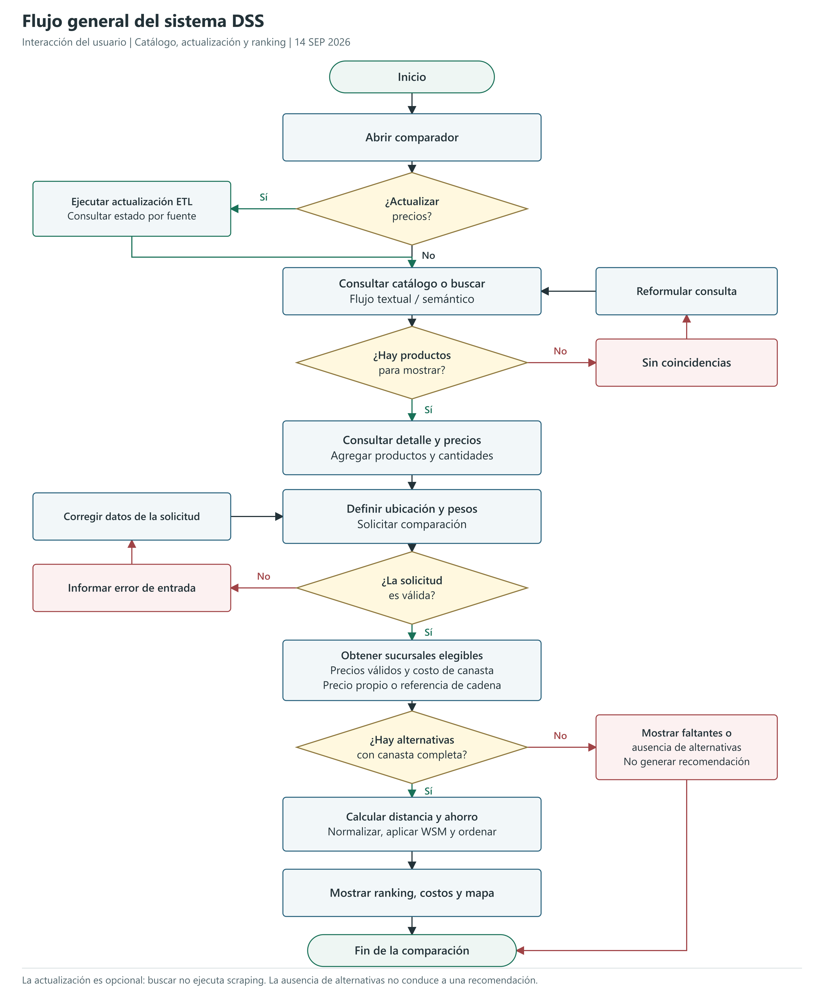
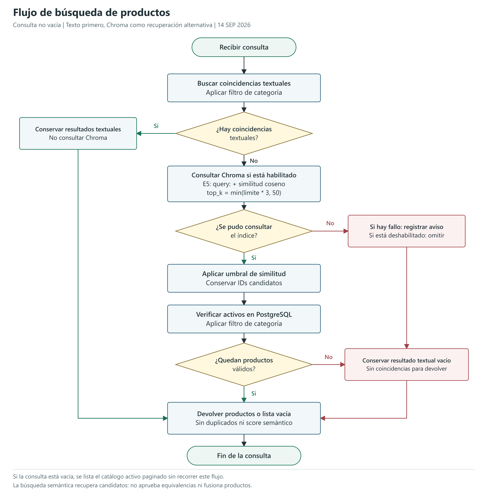
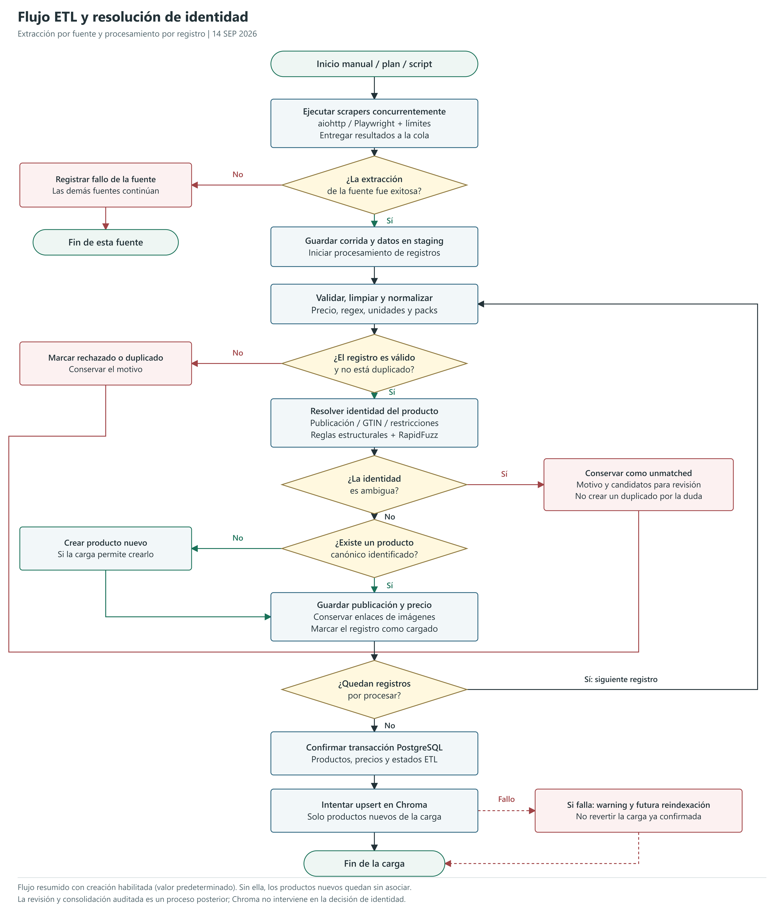

# Diagramas de flujo del sistema actual

Fecha: 2026-09-14. Diagramas basados en el flujo de usuario y los casos de
uso actuales. No modifican el codigo ni los archivos originales de la tesis.

## 1. Flujo general

Figura principal para el capitulo 3, **Analisis de Requerimientos / Casos de
Uso Principales**. Puede reemplazar en una futura edicion la figura 3.2,
sin tocar ahora la copia original.

Incluye actualizacion opcional, consulta, canasta, ubicacion, pesos, validacion,
construccion de alternativas y ranking. Los caminos de correccion representan
acciones del usuario, no redirecciones automaticas implementadas. No obtener
alternativas termina sin recomendacion; no se conecta con un ranking ficticio.
El subproceso ETL informa estados por fuente y no garantiza una actualizacion
exitosa de todas las fuentes antes de volver al catalogo.

## 2. Busqueda textual y semantica

Ubicacion: capitulo 3, **Implementacion de la Busqueda de Productos**.

Representa consultas no vacias. Si el texto tiene coincidencias, se devuelven
sin agregar resultados vectoriales. Chroma solo se consulta como alternativa.
Los IDs se filtran por umbral y se verifican contra productos activos en
PostgreSQL. Un indice vacio puede completar la consulta sin candidatos;
un fallo, indice ausente o deshabilitado conserva el resultado textual vacio.
No todos esos casos registran warning: el aviso corresponde a errores capturados.

Las consultas vacias siguen el listado paginado fuera de este diagrama.
La relevancia semantica no equivale a identidad del producto.

## 3. ETL e identidad

Ubicacion: capitulo 3, **Implementacion del Pipeline ETL**, como detalle de
la figura general del flujo de datos.

Resume una carga con creacion de productos habilitada, que es el valor
predeterminado. Las fuentes se extraen concurrentemente y los registros de
cada corrida se procesan para su carga. Una falla de extraccion se registra
por fuente; no fuerza a cancelar las demas. Para una corrida sin registros
pendientes, se omite el recorrido por registros. Los errores fatales de
persistencia no se dibujan individualmente: se propagan al coordinador y una
transaccion no confirmada puede revertirse.

Las decisiones del matcher se distinguen de los estados persistidos:
`review_required` puede dejar staging como `unmatched`, con motivo y candidatos.
No implica que cada fila cree automaticamente una revision canonica. El
proceso posterior de revision/consolidacion auditada no forma parte del
upsert de Chroma.

El commit relacional ocurre antes de la indexacion. El upsert cubre productos
nuevos; su fallo no revierte la carga confirmada y puede repararse mediante
reindexacion. No se muestra como una transaccion distribuida.

## Formatos y leyenda

- Rectangulo: proceso. Rombo: decision. Terminal redondeado: inicio o fin.
- Flechas con Si/No: condiciones. Rojo: ausencia, rechazo o error.
- Flecha discontinua en indexacion: camino de fallo no fatal posterior al commit.
- Cada diagrama tiene version `.svg` vectorial y `.png` a doble resolucion.
- `render-flows.cjs` contiene las definiciones editables. Requiere Node y Sharp.

## Referencias de implementacion

- `frontend/src/views/CompareView.vue` y `frontend/src/services/api.ts`.
- `backend/app/modules/catalog/interfaces/http/routes.py`.
- `backend/app/modules/catalog/application/use_cases/search_products.py`.
- `backend/app/modules/ingestion/application/use_cases/concurrent_refresh_scraping_sources.py`.
- `backend/app/modules/ingestion/application/use_cases/load_scraping_run.py`.
- `backend/app/modules/ingestion/infrastructure/etl/product_identity_matcher.py`.
- `backend/app/modules/decision/application/use_cases/generate_ranking.py`.

Las figuras documentan el comportamiento y sus supuestos. No son evidencia
de un experimento nuevo ni garantia de stock fisico o precision del buscador.
